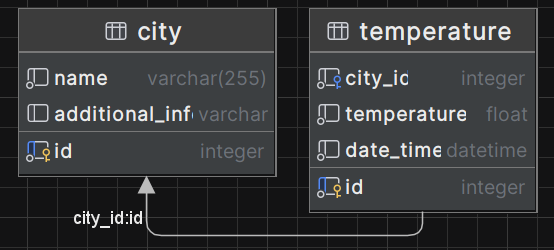

## Fastapi city tempreature management

> A simple tool for monitoring local temperatures

Here is the structure of the database: 


This project implements several endpoints:
- All crud operations with City
- Get all Temperatures
- Update all temperatures from [external api](https://www.weatherapi.com/)


### Project setup

1. Create virtual environment:
```
python -m venv venv
```
2. Install requirements.txt:
```
pip install -r requirements.txt
```
3. Generate weather api key on [weatherapi.com](https://www.weatherapi.com/). You have to register an account, but api key is free.
4. Create `.env` file just like `.env.example` and paste your api key here.
5. Generate alembic migration by running following command:
```angular2html
alembic revision --autogenerate -m "Initial migration"
```
6. Apply the migration:
```
alembic upgrade head
```
7. Run fastapi server:
```
fastapi dev main.py
```
8. If you have done everything correctly, you will get `{"message":"Hello World"}` message on:
```
http://127.0.0.1:8000
```

### Project documentation

Documentation is available at: 
```
http://127.0.0.1:8000/docs  
```

